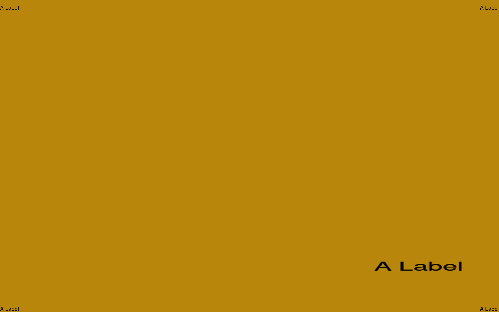

> (MacOS) A command line script that sets an image for your desktop background with a label in all corners and a larger label lower mid-right. Places the image in ~/Desktop/chbg and is created with ImageMagick.




Above created with `chbg -bg "Dark Goldenrod" A Label`:


# Usage

```
usage : chbg [-bg|--bgcolor X] [-h|--help] label

  label - text to display on the screen.

  -bg|--bgcolor X : set the screen's color to X
         ex. 'rgb(1,1,1)', '#555', 'red'
  --colors : show X11 colors page.

```

Ex. To set the desktop virtual window (i.e. Spaces desktop) to the color "Dark Goldenrod" with the label of "Email", because you do email in that window, type: `chbg -bg "Dark Goldenrod" A Label`.


# Installation

`make install`

## Troubleshooting

- Requires imagemagick : `brew install imagemagick`
-   ...which requires Ghostscript : `brew install gs`

